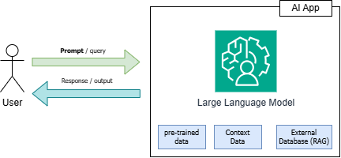

# prompt-engineering

The purpose of this repo is to help you to enhance your prompting skills

## What is a prompt in the context of AI ?

## Why I should learn about prompt engineering ?

A prompt is the input and/or instruction given to a AI Model in order to guide Its response. The better you guide the AI Model's responses, the more your work will be boosted.
